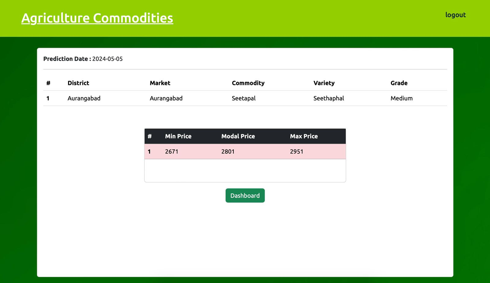
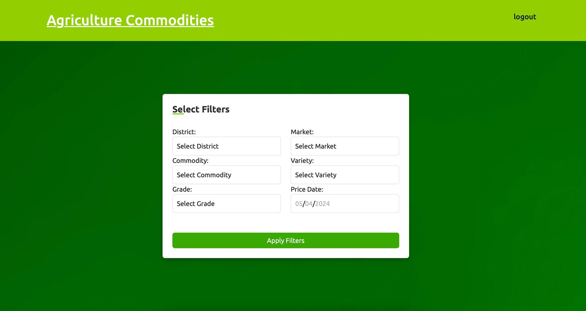
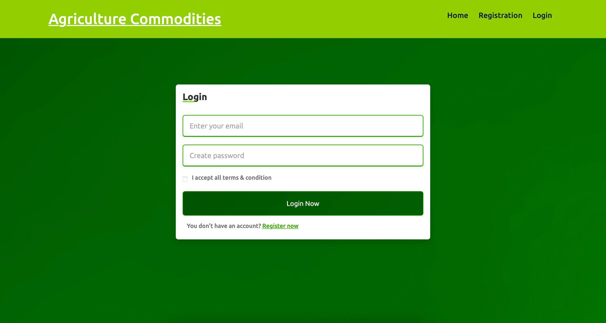
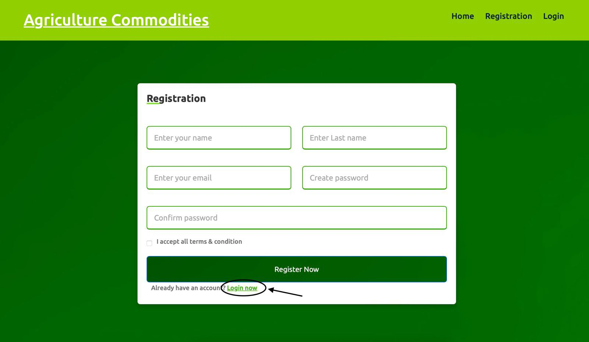

# Agriculture-Commodity-Price-Prediction

## Overview
This project is a web-based application that predicts agricultural commodity prices using Machine Learning, specifically the Support Vector Machine (SVM) algorithm. It is designed to help farmers, traders, and policymakers make data-driven decisions in a highly volatile agricultural market.

The system leverages historical market data, including commodity prices and related attributes, to generate accurate predictions such as minimum, modal, and maximum prices. These predictions are presented through a clean and intuitive dashboard, making the insights easy to interpret.

In addition to the predictive model, the application provides a user-friendly interface with authentication and filtering features, allowing users to explore data based on district, market, commodity type, and date. The goal of this project is to bridge the gap between raw agricultural data and actionable insights, ultimately contributing to better planning, reduced risk, and improved efficiency in the agricultural ecosystem.

## Features
- User Authentication (Login/Register)
- Commodity Price Prediction (Min, Modal, Max)
- Filter-based search (District, Market, Commodity, Date)
- Clean and responsive dashboard UI

## Tech Stack
- Frontend: HTML, CSS, JavaScript  
- Backend: Python  
- Machine Learning: Support Vector Machine (SVM)

## Screenshots

### Dashboard

  

### Filters

  

### Login

  

### Register

  

